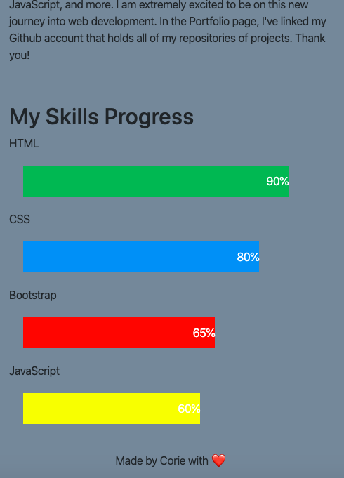

# 2nd_homework

This is my second homework, I created 3 tabs, portfolio, index, and contact in the fixed nav bar. I linked my first project in my Portfolio page, I also linked my LinkedIn account and Github account. For my contact page, I created a form for Name, Email, and Message. In the index page, I made a paragraph about me along with a card with some fun facts about me. I explain my new journey into web development and the importance of Github.

I learned a lot about responsiveness on bootstrap and the concept of the more manual media queries. I am also glad to begin my portfolio page and my goal is to make it look much better the more I learn in JavaScript and beyond. 

I've included 3 links in my nav bar linking to other parts of the website along with the links below the images in the portfolio page.

I have attached some screenshots of the 3 pages at varying sizes for responsiveness.

